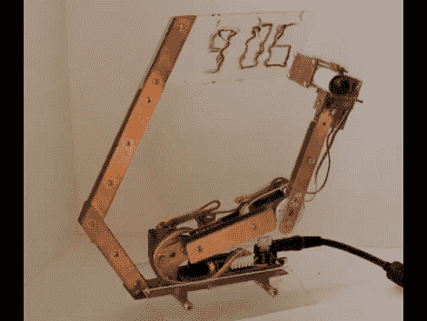

# 机器人涂鸦钟

> 原文：<https://hackaday.com/2012/03/14/robotic-doodle-clock/>

这个钟有一个机器人扭曲。它会用干擦记号笔来显示时间。手臂关节有一点松动，运动精度也有一些松动，这导致了波浪字体，促使[Ekaggrat]将他的项目命名为涂鸦时钟。

这里使用的形状和建筑材料让这款腕表看起来非常棒。我们认为，如果拿着丙烯酸书写表面的手臂成直角，这看起来就不那么令人愉快了。休息后的视频显示了机器人的行动，首先弯曲它的手腕，在记号笔和橡皮擦之间来回切换。从那里开始画时间，多次跟踪每个数字的片段，以获得可读的数字。整个事情是由安装在时钟底部的 Arduino 兼容板驱动的。

这让我们想起了[那个毡尖图灵机](http://hackaday.com/2010/03/27/turing-machine-a-masterpiece-of-craftsmanship/)。在此基础上的变化也将使一个真正漂亮的时钟显示。

[https://www.youtube.com/embed/lSdylL9qs7o?version=3&rel=1&showsearch=0&showinfo=1&iv_load_policy=1&fs=1&hl=en-US&autohide=2&wmode=transparent](https://www.youtube.com/embed/lSdylL9qs7o?version=3&rel=1&showsearch=0&showinfo=1&iv_load_policy=1&fs=1&hl=en-US&autohide=2&wmode=transparent)