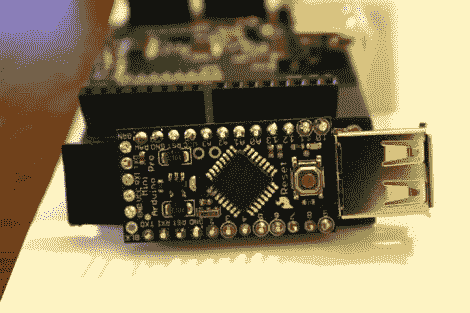

# 蓝牙上强大的无线 DSLR 控制

> 原文：<https://hackaday.com/2011/09/01/robust-wireless-dslr-control-over-bluetooth/>

[Manishi]写来分享他的最新项目，[一个与 Android 兼容的蓝牙 DSLR 控制器。](http://theiopage.blogspot.com/)他的设备不仅仅是一个蓝牙快门触发器，还可以让你控制一系列其他设置，如光圈、快门速度、ISO、白平衡、对焦位置和实时取景。

他的“YaNis”控制系统是使用 Arduino Pro Mini、USB 主机保护罩和他从 SparkFun 挑选的蓝牙模块构建的。显然，可以使用任何其他 Arduino 和 SPP 兼容的蓝牙板，尽管组件大小肯定是这个项目的一个考虑因素，他的选择非常适合这项工作。Arduino 的一半软件严重依赖[【奥列格·马鲁佐夫】的 PTP/USB 库](https://www.circuitsathome.com/mcu/usb-host-shield-library-version-2-0-released)来完成任务，但是[免费的 Android 控制应用](http://code.google.com/p/yanis-android-wireless-camera-controller/)都是【马尼西】的创造。

蓝牙加密狗通过 USB 连接到相机，一旦它与他的 Android 手机配对，[Manishi]就可以完全控制他的指尖。他计划在不久的将来进行大量的改进，包括额外的摄像头支持，所以我们希望在不久的将来我们会看到一个更强大的控制应用程序。

继续阅读，观看 YaNis 的快速视频演示。

[https://www.youtube.com/embed/3_SF-b7aH58?version=3&rel=1&showsearch=0&showinfo=1&iv_load_policy=1&fs=1&hl=en-US&autohide=2&wmode=transparent](https://www.youtube.com/embed/3_SF-b7aH58?version=3&rel=1&showsearch=0&showinfo=1&iv_load_policy=1&fs=1&hl=en-US&autohide=2&wmode=transparent)