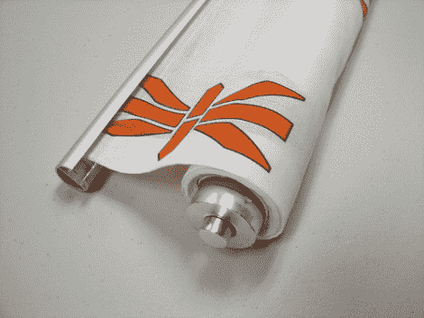

# 印有你图案的卷帘

> 原文：<https://hackaday.com/2010/11/26/roller-curtains-with-your-graphics-on-them/>

[Lenore]用定制印花面料安装了卷帘[，为她的办公室窗帘增添了一点定制色彩。上面看到的是宜家售价 20 美元的](http://www.evilmadscientist.com/article.php/ikeaspoon) [Enje 卷帘](http://www.ikea.com/us/en/catalog/products/00130643)，但那个标志却是[邪恶疯狂科学](http://evilmadscience.com/)。织物底部的重量使用摩擦配合的塑料插件，可以钉在新材料上。一些易熔胶带被熨烫到侧面，以完成这些边缘，顶部的滚筒具有强力粘合剂，在剥离原始材料后可再次使用。

织物打印机被用来制作这种色调的再现。但是我们希望看到为基于布的显示器添加一些导电线，不使用时可以卷起来。