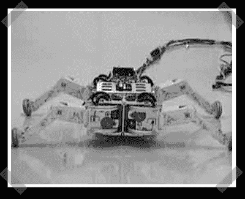

# 滚轴步行(溜冰)机器人

> 原文：<https://hackaday.com/2007/09/06/roller-walker-skating-robot/>

【Max T】送上[这个](http://www-robot.mes.titech.ac.jp/robot/walking/rollerwalker/rollerwalker_e.html)有趣的机器人设计。我喜欢组合动作设计。腿可以行走，或者轮子可以像时间机器一样转动机器人。这些腿不是为轮子提供动力，而是用来让机器人四处滑行——就像人类穿着冰鞋一样。

*   [永久链接](http://www-robot.mes.titech.ac.jp/robot/walking/rollerwalker/rollerwalker_e.html)