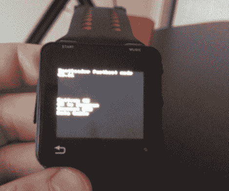

# 为摩托罗拉 Actv(安卓手表)加油

> 原文：<https://hackaday.com/2011/12/27/rooting-a-motorola-actv-android-wristwatch/>

[克里斯的]家人犯了个错误，送了他一份可折叠的圣诞礼物。我们敢打赌，在他着手为这款安卓手表找根的时候，他们在那天剩下的时间里没怎么看到他。

这东西的引擎盖下有一些非常强大的硬件。它配备了一个 600 MHz 的 OMAP3 处理器和 256 MB 内存。[Chris]需要拿到固件映像来寻找安全漏洞。他发现了一种欺骗更新应用程序的方法，以便从互联网上拦截升级映像。

他丢掉了固件位置，开始寻找利用该设备的方法。关于他到底做了什么，细节有点稀缺，但你可以下载他修改后的图像，让你使用 Android 调试桥创建自己的摩托罗拉 Actv。

休息之后我们嵌入了一段演示视频。这个操作系统在这个小设备上相当快。我们不确定这项功能会带来什么，但我们假设[克里斯]真的只对生根过程本身的挑战感兴趣。

[https://www.youtube.com/embed/AiAAlmyHa1Q?version=3&rel=1&showsearch=0&showinfo=1&iv_load_policy=1&fs=1&hl=en-US&autohide=2&wmode=transparent](https://www.youtube.com/embed/AiAAlmyHa1Q?version=3&rel=1&showsearch=0&showinfo=1&iv_load_policy=1&fs=1&hl=en-US&autohide=2&wmode=transparent)