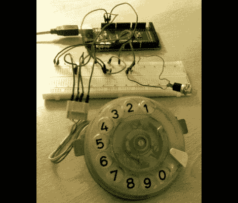

# 旋转拨号认证 Sudo 命令

> 原文：<https://hackaday.com/2011/02/01/rotary-dial-authenticates-sudo-commands/>

[W1ndman]不会因为这个构建获得任何安全奖项，但这是一个有趣的想法。在许多基于 Linux 的系统上，可以通过在命令前面加上关键字“sudo”来以管理员权限运行命令。通常你会被要求输入密码，但是[W1ndman]使用可插拔认证模块(PAM)通过他自己的 shell 脚本进行认证。该脚本[检查来自该转盘的代码以进行认证](http://www.instructables.com/id/sudo-authentication-via-old-phone-dial-pad)。Arduino 负责监听输入的每个数字，然后通过 USB 发送代码，以便与存储的文件进行比较。我们不确定存储的代码是在一个普通文件中还是受到保护，但至少这可以防止你随意使用“sudo”。