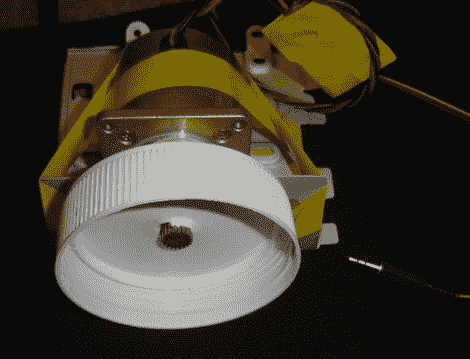

# 声卡的旋转编码

> 原文：<https://hackaday.com/2010/01/25/rotary-encoding-with-your-soundcard/>

[Stefan]提交了这份项目报告，向我们展示他如何使用步进电机作为旋转编码器。正如[Stefan]指出的那样，使用步进电机作为编码器并不是什么新鲜事，我们之前已经见过几次了。不过，他想以最快最简单的方式在他的电脑上使用它。他没有在单独的微处理器上进行任何解码，而是将步进器直接连接到他的声卡上，并编写代码来完成其余的工作。您可以下载该代码，并在他的网站上看到一些实际应用的视频。