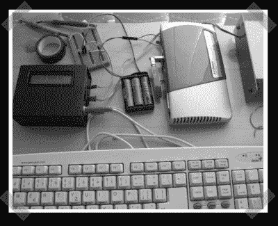

# 路由器终端:Atmega 串行终端

> 原文：<https://hackaday.com/2008/07/06/routerterm-atmega-serial-terminal/>

【亚当】在 [RouterTerm](http://knowhow.adamh.cz/routerterm) 中发出。这是一台 ATMega8，配有液晶显示器、PS/2 键盘输入和 16×2 液晶显示器。还没有来源/原理图，但他声称，如果有足够多的人问，他会抽出时间来。它是专门为与运行 Linux 的 Edimax BR-6104KP 路由器对话而构建的。

*   [永久链接](http://knowhow.adamh.cz/routerterm)