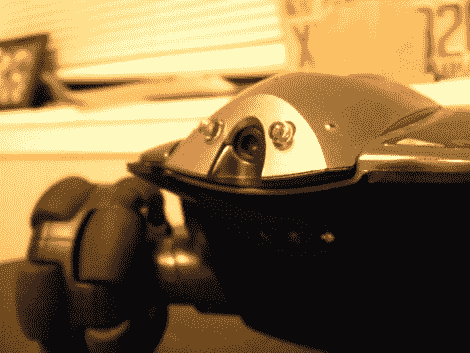

# Rovio 头灯黑客看起来股票

> 原文：<https://hackaday.com/2011/01/05/rovio-headlight-hack-looks-stock/>

即使是最彻底的检查也可能不会发出警报，即这个 Rovio 已经被[黑客攻击，包括 LED 头灯](http://www.hyundaiaftermarket.org/forum/index.php?/blog/3/entry-29-shedding-a-bit-of-light-off-rovio/)。[Adam Outler 的]超净作品将两个光源放在相机的两侧，以获得最大效果。它提供的流明可能没有我们的外部头灯 T2 多，但我们从来没有对容纳它的黑色投影盒感到兴奋。[Adam]在一块废弃的 perfboard 上构建了电路，使用晶体管将 LED 对连接到电池，原始的 LED 电源线连接到底座，以便切换晶体管。