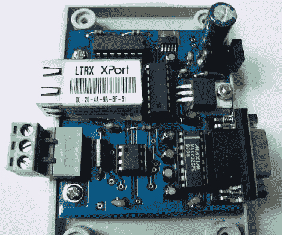

# RS232 和 RS485 网络–无需代码

> 原文：<https://hackaday.com/2010/08/14/rs232-and-rs485-networking-no-code-required/>

这里有一个[串行转以太网模块](http://www.kmitl.ac.th/~kswichit/tinyserver/tinyserver.htm)，你不必编写固件来构建。它使用[一个 Lantronix XPORT 模块](http://www.lantronix.com/device-networking/embedded-device-servers/xport.html)为你处理所有的工作，包括一个嵌入式网络服务器。RS232 和 RS485 数据总线都通过电平转换器连接到 XPORT 串行输入，将信号降至 3.3V。由于以太网模块的原因，这种解决方案的价格较高，但它将成为测试两种串行协议项目的良好原型工具。