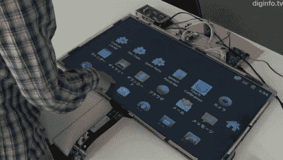

# 在大型触摸屏显示器上运行 Android

> 原文：<https://hackaday.com/2011/07/11/running-android-on-large-touch-screen-displays/>

忘记微软 Surface 吧，你觉得在你的客厅里放一个 32 英寸的安卓触摸屏怎么样？多亏了日本 SKR 技术公司的工程师，这种可能性可能不会太遥远。

他们主要是一家设计和构建数字标牌的公司，一些客户找到了他们，他们想要一款具有类似于智能手机的多点触控功能的大屏幕设备。因为他们经常使用 Windows，所以他们尝试围绕 Windows 7 构建一个解决方案，但它并不像他们希望的那样顺利。相反，他们转向 Android，但失望地发现他们的供应商都不支持该操作系统。

他们没有放弃这个项目，而是建立了自己的界面，允许 Android 驱动的设备与多点触摸显示器进行交互。正如你在视频中看到的，嵌入在显示器下方的效果非常好，可以镜像 Android 设备屏幕上的所有内容。

虽然该产品尚未上市，但我们应该会在今年晚些时候看到它上市。我们希望在未来的某个时候也能看到开源版本，即使我们买不起 32 英寸的触摸屏。

[https://www.youtube.com/embed/TNzt1SdEDu8?version=3&rel=1&showsearch=0&showinfo=1&iv_load_policy=1&fs=1&hl=en-US&autohide=2&wmode=transparent](https://www.youtube.com/embed/TNzt1SdEDu8?version=3&rel=1&showsearch=0&showinfo=1&iv_load_policy=1&fs=1&hl=en-US&autohide=2&wmode=transparent)