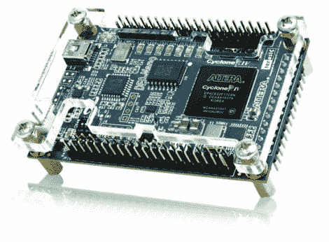

# 在 DE0-nano FPGA 板上运行 Linux 内核

> 原文：<https://hackaday.com/2011/09/27/running-the-linux-kernel-on-a-de0-nano-fpga-board/>

[Mike]一直在填写一个相当激烈的维基条目，概述如何在 DE0-nano FPGA 板上运行 uClinux。这是一款便宜的开发板，价格在 80 到 100 美元之间。他立刻列出了一大堆理由，证明这是一项愚蠢的活动。举几个例子:一旦你完成了构建，设备将被重新启动。该板没有以太网硬件，TCP/IP 是 uClinux 内核的主要特性之一。FPGA 工具是闭源的，这通常不符合 Linux 开发者的理想。但是我们仍然想知道如何才能让这些大范围的固件编译和正确加载。

在他的序言之后，你会发现三个主要部分。第一个是在 Fedora 14 上设置工具链。在那里，他安装交叉编译所需的包，下载源码包，然后开始工作。内核编译并在 FPGA 上运行后,[Mike]将继续向您展示如何构建一个简单的硬件插件，其形式为连接到额外 FPGA 引脚的几个 led。wiki 的最后一部分详细介绍了将 led 切换到软件发行版的滚动支持。