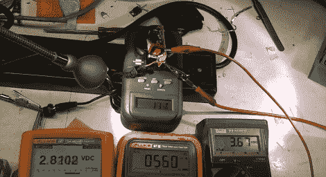

# 在廉价的 PSU 上运行数字

> 原文：<https://hackaday.com/2012/01/06/running-the-numbers-on-a-cheap-psu/>

[迈克]买了一个便宜的 USB 集线器，4 英镑(约 6 美元)，包括运费。他想知道如何以这个价格买到高质量的电子产品，你可能已经猜到这是不可能的。他打开了轮毂附带的电源[并接上电源进行一些测试](http://www.youtube.com/watch?v=T88ej64aXUM)。

壁式电源插座上有一个标签，声称在 5 伏电压下的额定电流为 1 安培。只看电路板就很容易看出这种硬件不符合规格。这是一款低端单面电路板，电路的电源端和调节端之间的隔离令人失望。据我们所知，变压器的低端确实没有可靠的调节电路，休息后[Mike]在剪辑中进行的测试表明了这一点。在上图中，从左到右，你可以看到电源线集线器侧的电压，负载上的电流，以及离开电路板的电压。仅在 560 毫安时，USB 集线器接收的电压已降至 3 伏以下！

这个项目的链接是[Paul]在阅读了关于[假佳能相机 PSU](http://hackaday.com/2012/01/04/exposing-some-fake-electronics-with-too-good-to-be-true-prices)的报道后发来的。我们喜欢这种东西，所以[保持提示来](http://hackaday.com/contact-hack-a-day/)因为你发现他们！

[https://www.youtube.com/embed/T88ej64aXUM?version=3&rel=1&showsearch=0&showinfo=1&iv_load_policy=1&fs=1&hl=en-US&autohide=2&wmode=transparent](https://www.youtube.com/embed/T88ej64aXUM?version=3&rel=1&showsearch=0&showinfo=1&iv_load_policy=1&fs=1&hl=en-US&autohide=2&wmode=transparent)