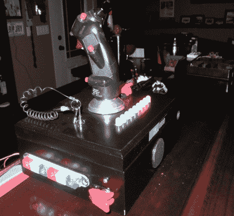

# 打捞的飞行杆控制视听系统，触发“应急方系统”

> 原文：<https://hackaday.com/2011/10/31/salvaged-flight-stick-controls-av-system-triggers-emergency-party-system/>

在网上看到一篇演示如何制作“紧急聚会按钮”的文章后，[斯派克]知道他必须有一个自己的按钮。他碰巧有一架从 A-10A 飞机上取下的美国空军 B-8 手柄，认为它非常适合控制他地下室的视听系统。

操纵杆被安装在一个廉价雪茄盒的顶部，里面塞满了他能找到的任何电子元件。它包含不是一个，而是两个 Arduinos。第一个任务是读取飞行杆的输入和他各种设备的红外控制，而另一个则触发他酒吧的顶灯和 X10 控制的紧急聚会系统。他考虑将所有功能整合到一个设备中，但将任务分成两部分对这位自称电子新手的人来说更容易。

控制杆上的各种按钮可以用来打开和关闭他所有的 A/V 设备，控制音量，并选择从他的数字点唱机播放哪些歌曲。如果行动开始放松，快速转动他的“武装”键，轻弹开关，他的地下室就会进入全面的派对模式，其中包括比任何人都应该被允许拥有的更多的照明和激光。

[spikec]说，当他第一次展示他的控制器时，他妻子的眼睛像“未装盖子的陀螺”一样转动，这表明他做得很好。不过不要相信我们的话，看看他的控制杆和紧急聚会系统在跳伞后的视频。

[https://www.youtube.com/embed/X2mLSjXG348?version=3&rel=1&showsearch=0&showinfo=1&iv_load_policy=1&fs=1&hl=en-US&autohide=2&wmode=transparent](https://www.youtube.com/embed/X2mLSjXG348?version=3&rel=1&showsearch=0&showinfo=1&iv_load_policy=1&fs=1&hl=en-US&autohide=2&wmode=transparent)