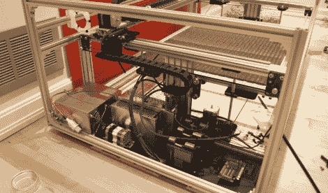

# 建造自己的激光切割机，节省大笔资金

> 原文：<https://hackaday.com/2011/04/14/save-boatloads-of-cash-by-building-your-own-laser-cutter/>

有大把的时间和 2500 美元的闲钱？为什么不安顿下来[给自己造一台激光切割机](http://buildlog.net/forum/viewtopic.php?f=16&t=391)？

这正是 Buildlog 论坛成员[r691175002]所做的，他刚刚在我们的评论中告诉了我们。激光切割机的成本可能非常高，这取决于你想拿起什么。我们能找到的最便宜的 Epilog 激光器要 8000 美元，你知道当你试图在网上买一个便宜的激光器会发生什么。

他没有使用现成的工具，而是从 Buildlog 购买了一个开源工具包，在线记录构建过程的亮点。建造日志走了一个很好的建设部分开始，框架和电机安装，继续通过布线的电子产品以及一些收尾工作。如果你碰巧朝四周看了看，你会发现有大量来自建设过程各个阶段的图片让你忙上一阵子。

说了这么多，做了这么多，[Ryan]对他的激光相当满意。在经历了构建过程之后，他提供了一些有用的构建建议，以及关于采购更便宜的硬件的提示。他估计，如果他今天就制造出这种激光器，他可能会将成本降低近一半。

毫无疑问，1300 美元的激光切割机对我们来说听起来相当不错。