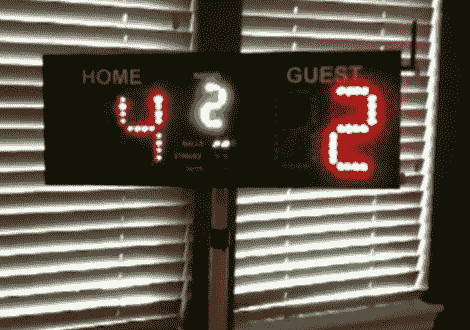

# 从零开始记分板

> 原文：<https://hackaday.com/2010/07/30/scoreboard-from-scratch/>

[Kenneth]建造了这个[记分牌，在一个没有这种奢侈品的棒球场](http://egeek.tumblr.com/)使用。我们认为这是对他的技能和钱包的非凡应用。他为 Eagle 中的每个数字设计了印刷电路板，并亲自蚀刻，然后在激光切割盒中安装了主队得分、客队得分、局数、球数、击球数和出局数的指示器。一个相当结实的电池和折叠支架使它非常便携。

在休息后的演示视频中，他通过 telnet 连接到记分板来更新比分。这个技巧是通过使用 [SparkFun 的无线 GSX](http://www.sparkfun.com/commerce/product_info.php?products_id=9333) 分线板来建立一个特别的无线网络来实现的。我们的目标是编写一个 iPhone 应用程序，用于控制场上(或者可以说是外场)的棋盘。

这绝对可以[在淡季](http://hackaday.com/2009/09/12/how-to-build-a-life-sized-electroni-game/)用于不同类型的得分。

[https://www.youtube.com/embed/Ccw5WhbPVZ4?version=3&rel=1&showsearch=0&showinfo=1&iv_load_policy=1&fs=1&hl=en-US&autohide=2&wmode=transparent](https://www.youtube.com/embed/Ccw5WhbPVZ4?version=3&rel=1&showsearch=0&showinfo=1&iv_load_policy=1&fs=1&hl=en-US&autohide=2&wmode=transparent)