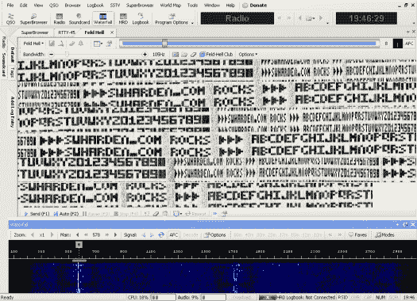

# [斯科特]在地球上做了一个单片 Hellschreiber

> 原文：<https://hackaday.com/2011/08/08/scott-made-a-single-chip-hellschreiber-on-earth/>

斯科特·哈登(Scott Harden)白天钻牙齿，晚上设计发送秘密信息的收音机。他将目光投向了 Hellschreiber 协议，这是德国人在第二次世界大战中与他们的 Enigma 加密系统一起使用的协议。对于其他通信系统来说，该协议是在具有太多背景噪声的环境中发送和接收代码的可行替代方案。

他的目标是只用一个微控制器开发自己的发射器。他挑选了一个 ATmega48，并将其与一个 40 MHz 的晶体振荡器耦合。[Scott]提到不需要其他硬件，但是静态消息存储在一个数组中，所以你需要一些其他硬件来通过芯片的 UART 或其他方式推送你自己的字符。AVR 通过使用 PWM 将数据转换成音频来发送消息。该信号被馈入晶体振荡器，产生一个调幅信号(AM ),然后可以发送出去。

休息之后，请观看他的视频演示。他正在使用一个名为[业余无线电豪华版](http://www.ham-radio-deluxe.com/Downloads.aspx)的免费程序解码传输的数据。

[https://www.youtube.com/embed/_MJYwXvwTvY?version=3&rel=1&showsearch=0&showinfo=1&iv_load_policy=1&fs=1&hl=en-US&autohide=2&wmode=transparent](https://www.youtube.com/embed/_MJYwXvwTvY?version=3&rel=1&showsearch=0&showinfo=1&iv_load_policy=1&fs=1&hl=en-US&autohide=2&wmode=transparent)