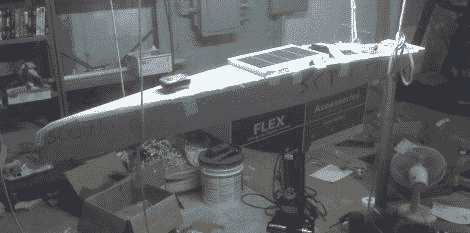

# 斯科特，自主横渡大西洋的船

> 原文：<https://hackaday.com/2011/05/02/scout-the-autonomous-transatlantic-boat/>

驾驶一艘小船横渡大西洋是一项令人生畏的任务。正如许多人发现的那样，这是一次充满危险的旅程，通常以失败告终。一个由四名大学生组成的团队决定，让一艘小船穿越海洋的最佳方式是消除这个过程中的人为因素，因此他们开始建造一艘自主船来承担这项任务。

像大多数项目一样，这个项目开始于朋友们(迪伦·罗德里格斯和马克斯·克莱默斯)之间交换的一些疯狂的想法。他们想得越多，就觉得把(马克斯的)帆船变成一艘自主的远洋船会非常棒，于是他们开始工作。在他们的朋友[Brendan Prior 和 Ricky Lyman]的帮助下，这个项目开始迅速成形，Scout 诞生了。

Scout 长 8 英尺，由碳纤维包裹的泡沫芯组成。它充满了各种电子元件，如点跟踪器、为船只提供长达 25 小时电力的电池组，以及用于驾驶船只的各种伺服系统和电机。

这是一个相当雄心勃勃的项目，尽管这艘船已经接近完工——正好赶上定于 5 月 29 日的下水。随着发布日期的临近，我们一定会密切关注这个项目——祝你们好运！

[前往他们的 Kickstarter 页面](http://www.kickstarter.com/projects/601285608/scout-the-autonomous-transatlantic-boat)观看介绍 Scout 的宣传片。