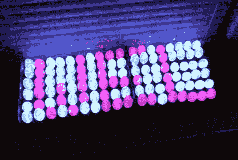

# 通用电气圣诞灯制成的滚动字幕

> 原文：<https://hackaday.com/2011/01/11/scrolling-marquee-made-from-ge-christmas-lights/>

[约翰·雷尼]拿起三股可寻址的圣诞灯，[用它们做了一个滚动字幕](http://www.youtube.com/watch?v=WbtTBSTp0hk)。你可能记得 [G-35 灯在 12 月初被黑](http://hackaday.com/2010/12/01/hacked-led-christmas-lights/)，我们看到[有一两个项目](http://hackaday.com/2010/12/16/chat-list-indicator-uses-hacked-xmas-lights/)涉及这些有趣的玩具。

为了制作这种显示器,[John]修改了最初的包装材料，使其在一个 6x 18 的网格中容纳三条线，总共 108 个像素。在休息后的视频中，他指出了该链的一个有趣的特征，我们在查看原始黑客时不记得了；每个灯泡的地址不是固定的，可以在通电后设置。这与发送颜色数据的方式相同，只是您只需发送地址。从微控制器编程的角度来看，这使得控制这样的电网变得极其容易。一旦所有的地址都进入串行总线，你就可以开始发送颜色和亮度数据包了。

设置快速、明亮、美观，只需 Arduino 的三个引脚进行控制。唯一阻碍我们亲自尝试的是 150 美元的价格标签。但那是在假期之前，我们听到了一些关于该产品清仓交易的传言。

[https://www.youtube.com/embed/WbtTBSTp0hk?version=3&rel=1&showsearch=0&showinfo=1&iv_load_policy=1&fs=1&hl=en-US&autohide=2&wmode=transparent](https://www.youtube.com/embed/WbtTBSTp0hk?version=3&rel=1&showsearch=0&showinfo=1&iv_load_policy=1&fs=1&hl=en-US&autohide=2&wmode=transparent)