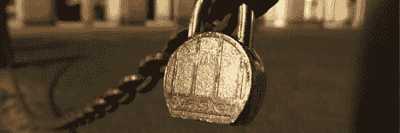

# 保护您的数据

> 原文：<https://hackaday.com/2008/12/20/securing-your-data/>

Lifehacker 发布了一份概述，介绍了一些保护数据安全的方法。这个帖子是由最近发布的浏览器漏洞引发的:先是 [IE](http://news.bbc.co.uk/2/hi/technology/7784908.stm "BBC NEWS | Technology | Serious security flaw found in IE") ，然后是 [Firefox](http://news.cnet.com/8301-1009_3-10126106-83.html "Mozilla patches highly critical security flaws | Security - CNET News") 。它们涵盖了远远超出浏览器安全的技术，比如如何正确删除你的 iPhone。他们提到了磁盘加密工具 [TrueCrypt](http://www.truecrypt.org/downloads.php "TrueCrypt - Free Open-Source On-The-Fly Disk Encryption Software for Windows Vista/XP, Mac OS X and Linux - Downloads") 以及密码管理工具，如 [KeePass](http://keepass.info/ "KeePass Password Safe") 。他们还建议使用临时信用卡来减轻欺诈的影响。

[照片:t0]rija 2.0