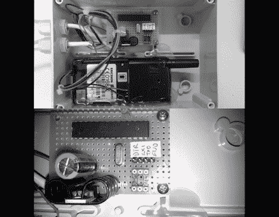

# 安全系统感应到入侵者时会给你打电话

> 原文：<https://hackaday.com/2011/09/08/security-system-gives-you-a-call-when-it-senses-intruders/>

[Dimitris]决定建造一个自制的警报系统，但是他宁愿当有麻烦发生时，他的系统会打电话给他，而不是触发警报器，发送短信，或发微博告知有人入侵。他说他更喜欢打电话而不是发短信，因为如果接听者不接电话，就不会产生任何费用，而发短信则不是这样。

该系统基于一个现成的运动探测器，该探测器被黑客攻击后可与一部旧手机配合使用。运动探测器最初触发了警报器，但他把扬声器拆了出来，并把它连接到他自己制作的一个简单的 Arduino 板上。Arduino 又连接到一个未使用的 Ericssson T10s 移动电话的串行端口。这使得 Arduino 可以在运动检测器检测到运动时呼叫他的移动电话。

该系统看起来非常有用，虽然[Dimitris]没有包括他使用的所有代码，但他说其他人应该可以毫不费力地复制他的工作。