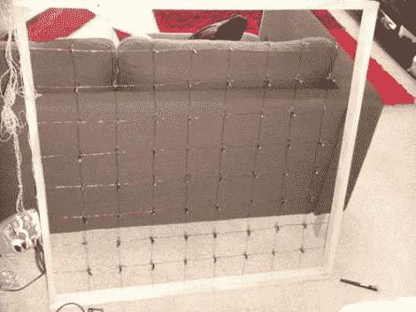

# 透明 LED 显示屏

> 原文：<https://hackaday.com/2011/02/03/see-through-led-display/>

[Ndsit]要举办一个派对，想用一些闪亮的灯让这个地方活跃起来。当谈到爱好电子产品时，他有点新，尽管我们强烈建议邀请一些电阻参与，但他构建的 LED 矩阵非常好。它是 8×8 的，很大，而且(如休息后的剪辑所示)灯光似乎悬浮在半空中。这是因为他没有使用基板来制作显示器。漆包线网格被串在木框的四边之间。led 是从一串圣诞灯中收集的，这意味着它们在一个支架中，并且已经连接了绝缘线。每一个都被系在网格的连接点上，然后连接到漆面被刮掉的电线上。

它可以工作，但是已经有一盏灯熄灭了。我们希望增加一些电流保护，以便可以反复使用。

【YouTube http://www . YouTube . com/watch？v=3Cls45QWcSE & w=470]