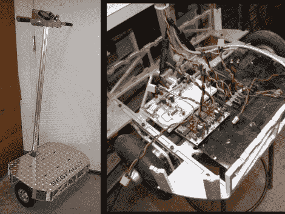

# Segfault:使用十几个运算放大器平衡传输

> 原文：<https://hackaday.com/2010/12/10/segfault-balancing-transport-using-a-dozen-op-amps/>

Segfault 是一种类似于 Segway 的平衡传输，但[它使用模拟比较器而不是数字电路](http://www.etotheipiplusone.net/?p=1074)。板上至少有 12 个 LMC6484 运算放大器。它们接收来自陀螺仪和加速度计的信号，进行平衡和滤波，然后相应地驱动电机 h 桥。

塞格福特背后的家伙【查尔斯】，也是[负责死亡之刃](http://hackaday.com/2010/07/08/wear-a-helmet-rollerblades-with-attitude/)的人。对于那个项目，他在记录方面和在制作方面做得一样好。花些时间欣赏他与这个双轮奇迹相关的帖子(尤其是[的建造过程](http://www.etotheipiplusone.net/?p=1084))，然后在休息后观看视频。

[https://www.youtube.com/embed/OmsUr2JLXLI?version=3&rel=1&showsearch=0&showinfo=1&iv_load_policy=1&fs=1&hl=en-US&autohide=2&wmode=transparent](https://www.youtube.com/embed/OmsUr2JLXLI?version=3&rel=1&showsearch=0&showinfo=1&iv_load_policy=1&fs=1&hl=en-US&autohide=2&wmode=transparent)

[通过[使](http://blog.makezine.com/archive/2010/12/segfault_an_analog_balancing_scoote.html)