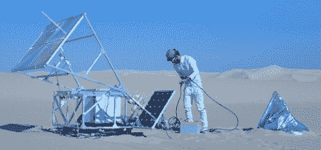

# 用沙子进行选择性太阳能烧结

> 原文：<https://hackaday.com/2011/06/25/selective-solar-sintering-with-sand/>

[Markus Kayser]建造了一台令人惊叹的太阳能 SLS 打印机，但他的机器没有使用激光和粉末塑料，而是使用太阳能将沙子加热成复杂的形状。

[Markus]“打印机使用与他早期的[太阳能切割机](http://www.markuskayser.com/work/sun-cutter/)相同的概念——用放大镜烧东西。有趣的是，打印机不是由步进电机和 reprap 电子设备控制的，而是完全由凸轮驱动的。太阳能电池板只为附在框架上的马达提供动力，马达在由滑板轮子制成的轴承上运动。

我们猜测,[Markus]在他的项目中使用了 2 平方米多一点的菲涅耳透镜。由于太阳辐照度约为 120 W/m(PDF 警告)，[Markus]将大量能量集中到一个 25 美分硬币大小的点上，这是将沙子加热到 1500 摄氏度熔点所必需的。分辨率不是用激光可以得到的，但[Markus]能够打印出一个令人惊叹的[碗](http://www.markuskayser.com/files/gimgs/4_08img0566w800110615-1.jpg)以及其他复杂的 3d 形状。

休息之后，请查看[Markus]的太阳能烧结打印机视频。还有一个[视频](http://vimeo.com/25361014)是他之前用太阳能切割器做的实验。

[https://player.vimeo.com/video/25401444](https://player.vimeo.com/video/25401444)