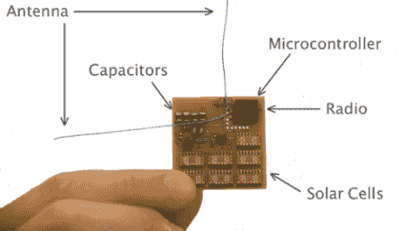

# 花 300 美元把卫星送上太空

> 原文：<https://hackaday.com/2011/10/11/send-a-satellite-into-space-for-300/>

有一个新的 Kickstarter 活动，承诺用 300 块骨头[发射一颗个性化卫星进入轨道](http://www.kickstarter.com/projects/251588730/kicksat-your-personal-spacecraft-in-space)。

KickSat 项目由[Zac Manchester]、[Mason Peck]、[Justin Atchison]和其他几位来自康奈尔大学的贡献者领导。他们的目标是发射一颗装满数百颗邮票大小的卫星的立方体卫星，并将这些“精灵”释放到近地轨道。

雪碧概念已经开发了一段时间，并且已经出现在 T2 的 IEEE Spectrum 上。这些小卫星是简单的印刷电路板，带有一个微控制器和一个由太阳能电池和电容器供电的无线电。Sprite 的第一个版本旨在传输几个字节的数据——只有一个唯一的标识符和一个 Kickstarter 支持者的名字。未来的版本无疑将包括更先进的传感器，如相机、温度计和非常微小的粒子探测器。

KickSat 团队将使用 Kickstarter 活动的资金来测试和集成这些系统。该团队希望搭上美国宇航局的一次 CubeSat 发射的顺风车，但是如果他们得到 400 人的资助，他们将在 2013 年初进行商业发射。

我们想知道这个 KickSat/Sprite 构建将产生的惊人数量的太空垃圾，但该团队表示不用担心:Sprite 在相当低的轨道上飞行，并将在部署后几周内重返大气层。考虑到人造卫星仅运行了 3 个月，还不错。