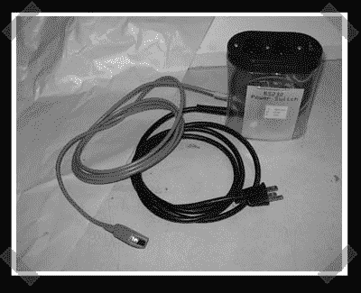

# 串行控制电源插座

> 原文：<https://hackaday.com/2006/11/04/serial-controlled-power-outlet/>

【艾伦】送我他的[简易 rs-232 控制电源插座](http://www.bolis.com/amillar/computers/hardware/serial-port-power-switch)。当队列中出现打印作业时，他会打开激光打印机。该继电器由串行端口上的 DTR 线直接控制。很多咖啡机的 PID 转换使用它们来运行锅炉，所以他可以避免额外的机械继电器。我不能过分挑剔他，我的老激光笔一直开着。]

他将它与一些 perl 捆绑在一起，一旦有足够的时间初始化，就打开打印机并开始打印作业。