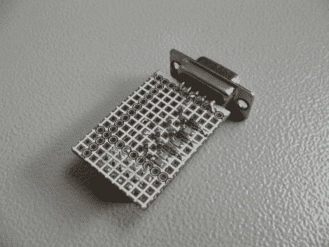

# 串口 JTAG 编程器

> 原文：<https://hackaday.com/2011/05/22/serial-port-jtag-programmer/>

如果你打算用 CPLD 或 FPGA 芯片做一些黑客工作，你需要一种方法来对它们进行编程。JTAG 是其中一个选择，这里有一个使用串口的便宜方法 ( [翻译](http://translate.google.com/translate?js=n&prev=_t&hl=en&ie=UTF-8&layout=2&eotf=1&sl=auto&tl=en&u=http%3A%2F%2Fmarsohod.org%2Findex.php%2Fourblog%2F11-blog%2F163-marsblaster))。

这种方法只需要四个信号(TDI、TMS、TCK 和 TDO)加上地。但问题是，RS232 串行端口以 12V 逻辑电平工作，而编程器的 JTAG 端需要以您正在编程的器件的本地逻辑电平工作。商业程序员使用一个电平转换 IC 来为你解决这个问题，但这并不符合这个项目的廉价目标。相反，[Nicholas]使用齐纳二极管和分压器进行转换。每一个数据信号都有一个 LED，如果你遇到问题，它会给你一些反馈。

您可以将它与[Nicholas]使用 Visual Studio 开发的编程应用程序一起使用。它通过串行端口工作良好，但他确实尝试用 USB 转串行加密狗编程。他发现这种方法会把过程减慢到难以忍受的 5 分钟。看一看，也许你能帮助把这种懒惰式的编程提高到一个可管理的速度。

[谢谢亚历克斯]