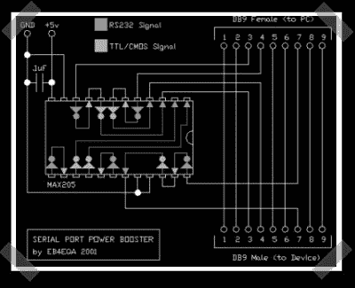

# 串行端口功率放大器

> 原文：<https://hackaday.com/2007/05/19/serial-port-power-booster/>

这个[一个](http://www.qsl.net.nyud.net/eb4eqa/) ( [珊瑚缓存](http://www.qsl.net.nyud.net:8080/eb4eqa/))有点拍脑袋，不过我觉得可能会派上用场。笔记本电脑(或 usb)串行端口因在功率输出上的吝啬而臭名昭著。[罗伯托]想出了一个聪明的解决办法。他使用 MAX205(类似于 double+ MAX232)和一个电容将笔记本电脑上的低功耗串行连接转换为 TTL 信号，然后再转换回 RS-232。结果是一个简单的加密狗，需要 5v 电压，并为那些耗电设备提供一个高功率串行端口——如[Roberto]的 PIC 编程器。

*   [永久链接](http://www.qsl.net.nyud.net:8080/eb4eqa/)