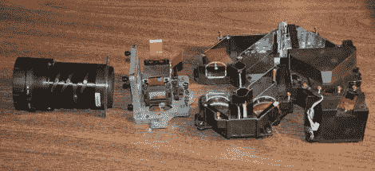

# 维修爱普生投影仪

> 原文：<https://hackaday.com/2010/10/28/servicing-an-epson-projector/>

[Socket7]他得到了一台存在颜色校准问题的投影仪。当然，维修手册上说里面没有技术人员可以维修的零件，但他还是把它敲开并修好了。这是一个 Epson PowerLite 5500c，它在投影图像的外部显示蓝色和黄色带。他能听到里面有什么东西在嘎嘎作响，那恰巧是镜片。事实证明，有泡沫垫保持他们的位置，随着时间的推移已经萎缩。经过一番仔细的工作后，他把它们放回原处，现在有了一台可以工作的投影仪。

我们希望拥有自己的投影仪；你可以用它们做很多很酷的事情。修理一个坏掉的是得到一个便宜的好方法，[socket 7]是免费的！