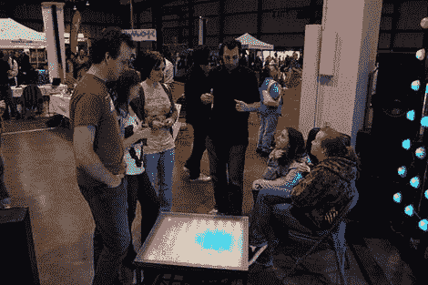

# Shiftbrite 咖啡桌

> 原文：<https://hackaday.com/2010/02/25/shiftbrite-coffee-table/>

这是一个我们一直想做的项目。在 macetech.com，他们张贴了一张使用 9×9 RGB LED 栅格的 [LED 茶几](http://macetech.com/blog/node/93)。对于 led，他们使用了我们之前见过的 [shiftbrite 模块](http://hackaday.com/?s=shiftbrite)。该表能够显示预先写入的模式，以及通过蓝牙从计算机接受模式。他们已经将它设置为连接到 twitter feed，并显示到他们网站上的直播摄像头。虽然我们很想复制这一点，但我们需要更多的理由，而不是“哦，闪闪发光”的资金。有人想捐 100 英镑吗？