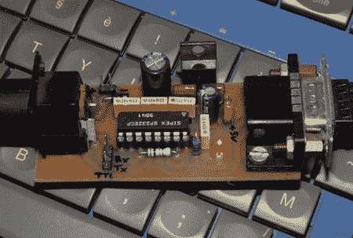

# 将 RS-232 硬塞进微型电话终端

> 原文：<https://hackaday.com/2011/05/22/shoehorning-rs-232-into-a-minitel-terminal/>

在 80 年代早期，数百万台终端被分发到法国电话用户手中。近 900 万个迷你电话哑终端同时在使用，如此普遍的程度，我们很惊讶我们以前没有听说过它们。这些机器通常通过内部的 1200bps 调制解调器与外界连接，但[O. Blt]想出了这个版本(谷歌翻译链接)，这样他就可以通过 RS-232 端口连接到本地机器。

在挖掘出 Minitel 的 DIN-8 端口的引脚后，[O. Blt]围绕从旧主板上收集的 MAX232 芯片设计了一个小电路板。当然，需要让终端做一些事情，所以[O. Blt]使用 Minitel 作为 Winamp 的显示器和遥控器。该项目是成功的，但不是很有用——在 1200 bps 时，刷新非常非常慢。

美国读者可能还记得用他们的 Apple ][s 和 C64s 通过 CommunityLink 连接到 Minitel 网络，但这项服务被 web 前拨号、Prodigy 和 Compuserve 这些巨头赶出了市场。无论如何，在看到这些旧盒子的阿泽蒂和 T2]字母键盘布局后，我们有一种怀旧的感觉，那是在所有与计算机相关的东西都标准化之前的一段时间。