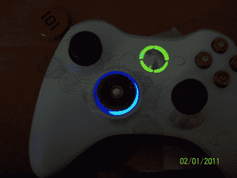

# 散弹枪爆炸点亮你的控制器

> 原文：<https://hackaday.com/2011/02/04/shotgun-blast-lights-up-your-controller/>

[Jrfhoutx]为 Xbox 360 控制器配备了这款[背光猎枪外壳 d-pad](http://www.acidmods.com/forum/index.php/topic,38610.0.html) ，让黑暗中的游戏变得更加轻松。他在[上发布了另一个教程](http://www.acidmods.com/forum/index.php?PHPSESSID=fa243b05e2abb9e8edc02ff58887caa5&/topic,35905.0.html)，展示如何使用猎枪子弹的黄铜底座来代替普通的塑料方向垫。这个黑客使用了大部分原来的塑料部件，把它切下来一点，用外壳底座盖住。但是现在他正在详细描述在底座周围添加 led 的过程。他挑选了表面贴装 0603 封装，这些封装首先被链接在一起，然后使用热胶固定在适当的位置。当你在那里的时候，也试试这个[速射 mod](http://hackaday.com/2008/07/28/simple-xbox-360-rapid-fire-mod/) 。