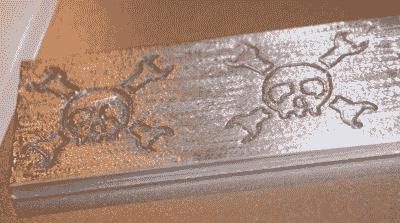

# 辅助项目:CNCBadges

> 原文：<https://hackaday.com/2007/10/14/side-project-cncbadges/>

想让您的最新电脑与众不同吗？我开始提供在我的工厂制造的[定制 CNC 切割箱徽章](http://cncbadges.com)。我从 1 英寸 x 1 英寸的徽章开始，徽章由 0.125 英寸厚的 6061 铝合金制成。上面的测试剪辑应该会让你对我所说的有一个大致的了解。(边缘有点粗糙，因为我需要订购一些合适的雕刻钻头。)我差不多解决了问题，所以我现在要开始接受订单了。在美国，雕刻徽章售价 6 美元，运费仅 1 美元。一切都非常，非常测试版-让我知道你是否有任何问题。

埃利奥特说，如果我分发一些“一日一黑”徽章，我就可以经营我的小企业。所以发表评论吧——我会随机挑选五个左右(除非你是个工具)来获得一个带有 Hack-A-Day 标志的免费徽章。我可能会考虑提供一天黑一次的徽章来为 EFF 筹集资金，但这仍然悬而未决。

*   [永久链接](http://cncbadges.com/)