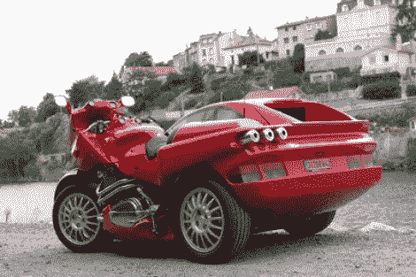

# 边车让人想起连体双胞胎

> 原文：<https://hackaday.com/2010/06/29/sidecar-reminiscent-of-conjoined-twins/>

最后，[对边斗愚蠢问题的答案](http://breganzane.com/blog//snfl.php/2009/05/23/completed-1)。[Fran ois Knorreck]花了[十年的时间手工制作了一辆双人用的边车](http://breganzane.com/blog//snfl.php/2009/05/23/the-construction)，设计精美，内部豪华。框架是铝制的，车身大部分是碳纤维，还有无数的细节，如自动链条张力控制和侧三轮转向，使这不仅仅是一个漂亮的油漆工作。

[谢谢 Geekabit]