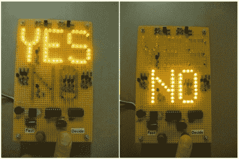

# 简单的设备像你的老板一样回答问题

> 原文：<https://hackaday.com/2011/08/15/simple-device-answers-questions-just-like-your-boss-does/>

像我们中的许多人一样，[Bertho]与那些似乎随意做决定的“执行”类型的人有过很多互动，而且肯定不是基于任何理由。当他在当地 hackerspace 的零件箱中挑选零件时，他认为建造一个“执行决策者”会很有趣。他心目中的设备[将在按下按钮](http://www.vagrearg.org/?p=edm)时回答问题，这种随机性只能通过角落办公室多年的咆哮命令来仔细磨练。

该设备由三流 led 和废弃的旧 CMOS 芯片构成，操作非常简单。就像一个神奇的 8 号球，提出一个问题，正如[Bertho]所说，“执行决策者自动调谐到以太和用户的潜意识”按下“决定”按钮。该设备然后做出判断，通过 LED 显示屏将答案传达给用户。

我们肯定被这个逗笑了，所以休息后一定要看看视频，看看执行决策者的行动。

[https://www.youtube.com/embed/41WzqBAjGuI?version=3&rel=1&showsearch=0&showinfo=1&iv_load_policy=1&fs=1&hl=en-US&autohide=2&wmode=transparent](https://www.youtube.com/embed/41WzqBAjGuI?version=3&rel=1&showsearch=0&showinfo=1&iv_load_policy=1&fs=1&hl=en-US&autohide=2&wmode=transparent)