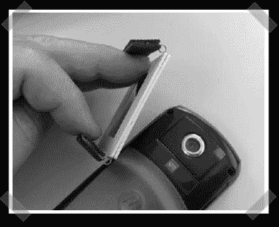

# 简易数码相机分光镜

> 原文：<https://hackaday.com/2008/02/28/simple-digital-camera-spectroscope/>

【JC doré】发来[这个](http://www.lamaredunet.fr/?page_id=34)[英文](http://www.google.com/translate?u=http%3A%2F%2Fwww.lamaredunet.fr%2F%3Fpage_id%3D34&langpair=fr%7Cen&hl=en&ie=UTF8)有趣的光学黑客。橡胶把手是由一个旧的鼠标垫制成的，夹子的弹簧是从 zip 驱动器软盘中抢救出来的。一对旧照片幻灯片框架夹层衍射光栅幻灯片。(就像这个一样)这个简单的模块允许载玻片安装到大多数手机上，将它们变成数字[光谱仪](http://en.wikipedia.org/wiki/Spectrometer)。

*   [永久链接](http://www.lamaredunet.fr/?page_id=34)