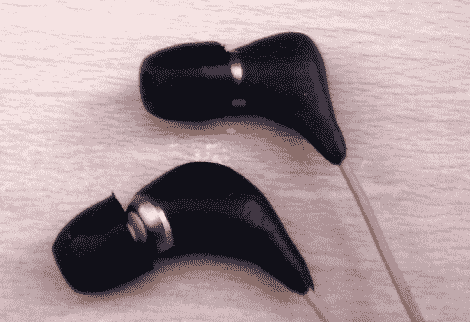

# 简单的耳机维修节省了一大笔钱

> 原文：<https://hackaday.com/2011/11/01/simple-earphone-repair-saves-a-big-chunk-of-cash/>

[Spode]戴着一副舒尔 E4C 耳机已经有六年了，而且他近期没有购买另一副耳机的打算。耳机花了他 200 英镑，所以当右声道开始出问题时，[他决定修理它们](http://www.spodesabode.com/discussion/330/headphone-repair-using-sugru/)而不是把它们扔进垃圾桶。

他的第一次尝试成功了，但仅仅是勉强成功。他最终严重损坏了耳机外壳，同样的问题再次出现。他没有被吓倒，选择再次修复它们，但这一次他做了不同的事情。

拆开后，他发现随着时间的推移，他的修理工作已经磨损了。[Spode]从电线上拆下两个驱动器，并将其切掉一点，露出一些漂亮干净(结构合理)的电缆。他花了更多的时间小心翼翼地将东西焊接在一起，以减少在用一点黑色 Sugru 替换两个耳机外壳之前不得不再次修理它们的机会。

为自己节省了 200 英镑后，[斯波德]对这次修理非常满意。我们可能会在每根电缆上打一个保险商的结，然后以消除应力的名义将它们焊接到驱动器上，尽管 Sugru 应该有助于这一点。