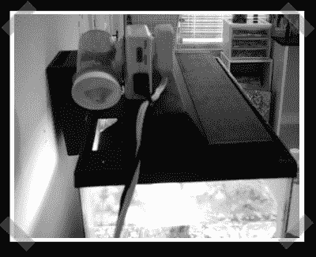

# 简易喂鱼器

> 原文：<https://hackaday.com/2008/07/20/simple-fish-feeder/>

【BahaTanju】送进来的这个哦这么简单[喂鱼器](http://bahatanju.pbwiki.com/My-Hacks)。这是一个机械光计时器，一个简单的配药瓶安装在旋转的时间轮上。随着计时器的旋转，食物被分发，水族箱灯被激活。如果你有更大的鱼，你可以调整这个工作在一个螺线管上，并使用一个多开/关设置的定时器。

*   [永久链接](http://bahatanju.pbwiki.com/My-Hacks)