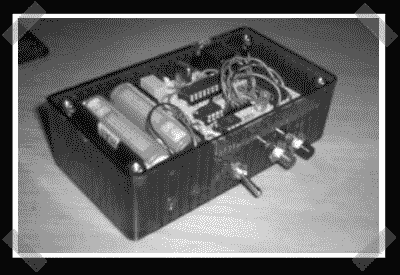

# 简单的 GPS 数据记录器

> 原文：<https://hackaday.com/2007/09/11/simple-gps-data-logger/>

【斯蒂芬】[送来了这个为气象气球项目建造的](http://www.jay-t.de/hardware_hacks/index.html)数据记录器。这是一个非常简洁的设计，可以记录到 64KB 的 eeprom，可以通过手机短信传输其位置，并在需要时根据位置触发相机。该网站有一个 tarball 将全部原理图和来源-国防部了。

*   [永久链接](http://www.jay-t.de/hardware_hacks/index.html)