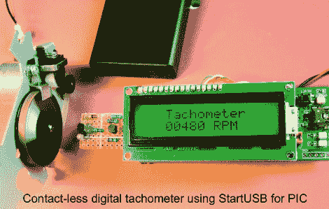

# 简易红外反射转速表

> 原文：<https://hackaday.com/2011/04/22/simple-ir-bounce-tachometer/>

[Rajendra Bhatt]写信给我们，让我们知道一个漂亮简单的 [IR 反弹转速表](http://embedded-lab.com/blog/?p=2425)。该项目使用一个用于 PIC 板的 startUSB 和一个 16×2 字符 LCD 以及一个非常基本的红外反射电路。测量旋转物体中的反射或非反射点，在这种情况下是一张白纸，micro 据说能够以 60 RPM 的分辨率测量高达 99，960 RPM(我们认为纸可能会在这一点上飞走)。这和光束中断式[转速表](http://hackaday.com/2011/01/28/simple-sensors-to-calculate-rpm/)的概念是一样的，但是把你所有的电子设备都放在[旋转危险](http://hackaday.com/2008/05/11/human-sync-optical-tachometer/)的一端。

本文还详细介绍了如何设置 PIC18F2550 的定时器 0 寄存器来使能 16 位分辨率。PIC 配置为打开红外 LED 一秒钟，测量脉冲数(通过定时器寄存器)，并将该值乘以 60。我们对 TMR0H 和 TMR0L 计数器要更加小心，因为它们必须以一定的顺序读写才能保持其值，但您需要在 15，360 rpm 以上的转速下测量才会遇到这种误差。

这是一篇高质量的文章，适合任何有兴趣了解 PIC 板启动 USB、转速表或新项目的人。谢谢[Raj]！