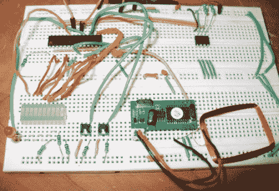

# 简单 RFID 访问系统克隆

> 原文：<https://hackaday.com/2011/02/07/simple-rfid-access-system-clone/>

几个月前，[John]读到一篇关于简单的 RFID 安全系统套件的文章，他决定自己也做一个。虽然提供了系统的许多细节，包括完整的原理图，但他沮丧地发现该项目的源代码没有公布，因为它受制造商的版权保护。他认为开源更好，于是修改了最初的设计，用配备 Arduino 引导程序的 ATmega328 替换了他们的 PIC 控制器。

他的系统复制了原始套件的所有功能，同时提供了大量超出初始设计的修改机会。本文包含一个完整的部件列表、布线示意图和启动和运行所需的 Arduino 代码。他甚至有一个他的克隆人工作的视频，演示了 RFID 标签的接受和拒绝以及系统的学习模式。