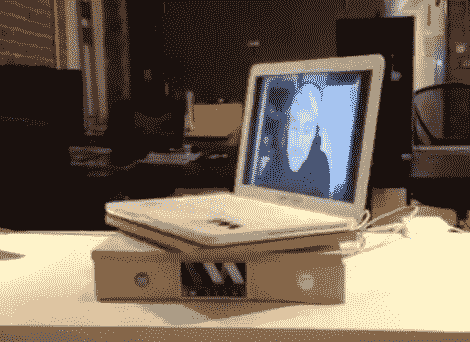

# 简单的网真黑客让远程用户旋转这台笔记本电脑

> 原文：<https://hackaday.com/2011/11/17/simple-telepresence-hack-lets-remote-user-rotate-this-laptop/>

[Kris]希望让他办公室的远程办公员工能够更好地控制他们在办公室的虚拟存在。他给了他们一种不需要使用成熟的机器人技术就可以四处查看的方法。这个笔记本电脑支架有一个连接到伺服电机的旋转转盘，让用户控制电脑的指向。

我们当然已经看到了像这个平衡机器人一样的非常复杂的代理构建。也有更简单的选择，如[这款搭载智能手机的电动底座](http://hackaday.com/2011/10/16/small-tabletop-telepresence-robot/)。但是当你开始使用它时，摇摄相机的能力对大多数情况来说已经足够好了。[Kris']解决方案可以在一个下午内完成，使用简单的材料。这个盒子是由中密度纤维板制成的，有一个笔记本电脑的底座，由滚珠轴承硬件连接，支撑重量，并确保伺服系统能够自由旋转。它由通过 USB 连接到计算机的 Arduino 驱动；使得远程控制变得容易。休息之后，请观看笔记本电脑循环播放的快速剪辑。

[https://www.youtube.com/embed/TKcPRt4awKU?version=3&rel=1&showsearch=0&showinfo=1&iv_load_policy=1&fs=1&hl=en-US&autohide=2&wmode=transparent](https://www.youtube.com/embed/TKcPRt4awKU?version=3&rel=1&showsearch=0&showinfo=1&iv_load_policy=1&fs=1&hl=en-US&autohide=2&wmode=transparent)

[谢谢扎克]