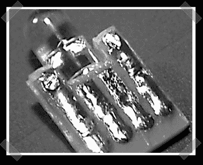

# 简单的 USB 插头

> 原文：<https://hackaday.com/2007/11/04/simple-usb-plug/>

我更喜欢[这个](http://www.bigmech.com/misc/usblink/)只是为了一个简单的 USB 插头，而不是它用来做什么的笑话。我在超小型 USB 闪存驱动器上看到过类似的情况，但那些通常是预先蚀刻的。这个想法是用一块原型板制作一个 USB 插头，并在上面安装一个超级明亮的 LED。的确是派。

*   [永久链接](http://www.bigmech.com/misc/usblink/)