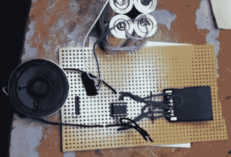
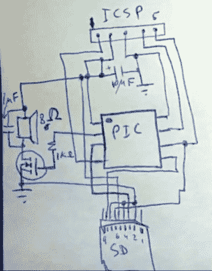

# 单芯片数字音频播放器

> 原文：<https://hackaday.com/2011/04/25/single-chip-digital-audio-player/>

【Dmitry Gr .】内置了[一个简单的电路来回放数字音频](http://www.youtube.com/watch?v=UtMgx4yMETw)。在中间，你可以看到一个 8 引脚 PIC 12F1840 微控制器。它从一个 microSD 卡中提取音频数据，通过一个全尺寸的 SD 卡适配器读取，他将跳线焊接到适配器上，进行所有必要的连接。还有一个额外的半导体，FET，用于驱动左边的扬声器。未经调节的电源由一对 AA 电池提供(在上图中可以看到四个，但实际上只有两个连接到电路)。他计划很快发布他的代码包，但现在你只能满足于几个演示视频和一个原理图。这两个视频都是在休息后嵌入的，我们还包括了第二个视频中显示的原理图截图。

这与我们大约一年前在一个链接帖子中看到的 1 位 Symphony CD 非常相似。那一个使用了一个珠宝盒，而不是这里看到的原型板，并有一个耳机插孔，而不是扬声器。

[https://www.youtube.com/embed/HRweAaubie0?version=3&rel=1&showsearch=0&showinfo=1&iv_load_policy=1&fs=1&hl=en-US&autohide=2&wmode=transparent](https://www.youtube.com/embed/HRweAaubie0?version=3&rel=1&showsearch=0&showinfo=1&iv_load_policy=1&fs=1&hl=en-US&autohide=2&wmode=transparent)

[https://www.youtube.com/embed/UtMgx4yMETw?version=3&rel=1&showsearch=0&showinfo=1&iv_load_policy=1&fs=1&hl=en-US&autohide=2&wmode=transparent](https://www.youtube.com/embed/UtMgx4yMETw?version=3&rel=1&showsearch=0&showinfo=1&iv_load_policy=1&fs=1&hl=en-US&autohide=2&wmode=transparent)

