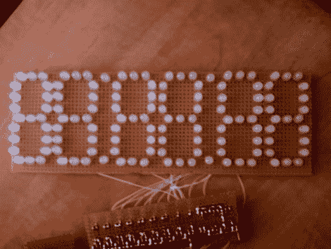

# 六位数 LED 时钟

> 原文：<https://hackaday.com/2010/06/02/six-digit-led-clock/>

手边有一袋发光二极管吗？为什么不用它们做一个展示呢？我们见过很多使用 LED 模块的时钟，但焊接自己的模块是一种有趣的消遣。[Vadim Suhovatih]就是这样做的，他使用了 [130 个发光二极管来建造这个时钟](http://www.instructables.com/id/Make-A-Digital-Clock-From-Scratch/)。7 段数字的每一段由三个并联的发光二极管组成，由 2N4401 晶体管开关。Arduino 形式的 ATmega328 借助 DS1307 实时时钟和 4017 十进制计数器来控制设备，ds 1307 实时时钟用于计时，4017 十进制计数器用于扫描显示器。休息后请欣赏演示。

[https://www.youtube.com/embed/KHH1BDeHmBw?version=3&rel=1&showsearch=0&showinfo=1&iv_load_policy=1&fs=1&hl=en-US&autohide=2&wmode=transparent](https://www.youtube.com/embed/KHH1BDeHmBw?version=3&rel=1&showsearch=0&showinfo=1&iv_load_policy=1&fs=1&hl=en-US&autohide=2&wmode=transparent)