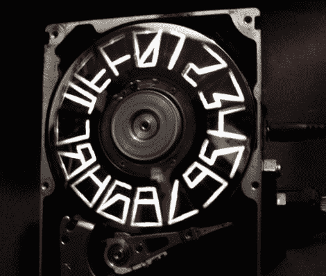

# 光滑的 16 段 POV 硬盘时钟

> 原文：<https://hackaday.com/2011/07/10/slick-16-segment-pov-hard-drive-clock/>

Hackaday 的读者[svofski]发来了一个由中国四川省的一个制造商创造的看起来很棒的基于硬盘的 POV 时钟。这座钟[就像【斯沃夫斯基】建造的](http://hackaday.com/2010/03/06/strobeshnik-an-hdd-clock/)一样，依靠放置在旋转盘子后面的 led 来创造视点效果。

在拼盘上做了一些精心放置的切割，组成了显示数字和字母所需的部分。然而，这不是简单的 16 段 POV 显示。字体使用了很多锋利的边缘和奇怪的线段长度，所以我们猜测在这个时钟的生产过程中花费了相当多的精力。

你可以在下面的视频中看到时钟的演示，展示了它显示数字、文本以及一些简单模式的能力。看起来设计师的网站上有一些细节，但是都是中文的，谷歌的翻译也有问题。要是我们知道有人能帮我们破译这个钟的内部工作原理就好了…

[https://www.youtube.com/embed/BE5rzA9dDk8?version=3&rel=1&showsearch=0&showinfo=1&iv_load_policy=1&fs=1&hl=en-US&autohide=2&wmode=transparent](https://www.youtube.com/embed/BE5rzA9dDk8?version=3&rel=1&showsearch=0&showinfo=1&iv_load_policy=1&fs=1&hl=en-US&autohide=2&wmode=transparent)