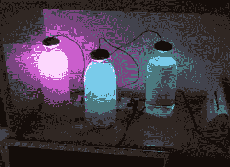

# 光滑的音乐同步灯光表演使用紫外线发光二极管和水

> 原文：<https://hackaday.com/2011/10/12/slick-music-synchronized-light-show-uses-uv-leds-and-water/>

[mike6789k]想为他的宿舍增添情趣，所以他建了一个很酷的音乐同步灯光秀，我们觉得这个想法很好。我们以前见过类似的基于音乐的可视化效果，但它们往往非常简单，依赖音量而不是实际的音频来触发灯光。

[mike6789k]不想建造“另一个”同步灯光秀，他的全模拟方法真实地再现了正在播放的音乐，而不仅仅是随着节拍闪烁的灯光。他使用三个简单的滤波器，将音频信号分成三个不同的频带，然后通过高增益晶体管驱动一组 led。

我们对显示器的亮度印象深刻，因为他使用的是紫外发光二极管，但 1W 的二极管在通过紫外反应水时照亮这个地方似乎没有问题，正如你在下面的视频中看到的。

如果你想为你的下一次聚会做一些类似的东西，Buildlounge 的人可以从[mike6789k]中获得一份原理图，你可以在这里找到。

[https://www.youtube.com/embed/Yd3hzYAJzOo?version=3&rel=1&showsearch=0&showinfo=1&iv_load_policy=1&fs=1&hl=en-US&autohide=2&wmode=transparent](https://www.youtube.com/embed/Yd3hzYAJzOo?version=3&rel=1&showsearch=0&showinfo=1&iv_load_policy=1&fs=1&hl=en-US&autohide=2&wmode=transparent)