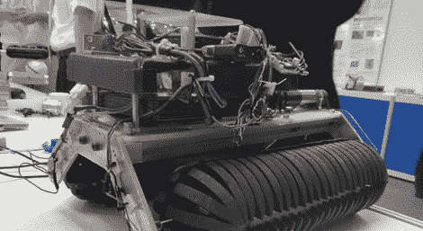

# 带坦克履带的光滑机器人可以向任何方向移动

> 原文：<https://hackaday.com/2011/10/03/slick-robot-with-tank-treads-can-move-every-which-way/>

看到新的和创新的机器人移动方式总是很有趣的。在最近的“创新日本 2011”会议上，大阪大学的研究人员展示了一种全方位爬行器，旨在改变机器人和人的移动方式。

Omni-Crawler 的移动是由 Omni-Balls 提供的，Omni-Balls 是大阪大学的一项发明，可以向各个方向移动，就像旋转脚轮一样。然而，Omni-Ball 的设计更简单、更坚固，这使得它比办公椅更加坚固。

这些全方位球中的几个被连接到履带上，并被包裹在橡胶坦克胎面状的抓取材料中。合成运动是可预测的全方位的，尽管我们猜测你已经通过大阪大学的命名惯例发现了这一点。

虽然我们不确定这项技术是否会很快进入量产车，但我们肯定可以在办公室里玩一个遥控全向履带车。

休息后留下来看看 Omni-Crawler 的视频短片。

[通过 [BuildLounge](http://www.buildlounge.com/2011/09/30/omnicrawler-tank-treads-meet-omni-balls/)

[https://www.youtube.com/embed/BTp2UAaihaI?version=3&rel=1&showsearch=0&showinfo=1&iv_load_policy=1&fs=1&hl=en-US&autohide=2&wmode=transparent](https://www.youtube.com/embed/BTp2UAaihaI?version=3&rel=1&showsearch=0&showinfo=1&iv_load_policy=1&fs=1&hl=en-US&autohide=2&wmode=transparent)