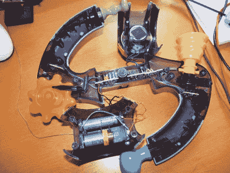

# 减慢速度，这样小家伙们也能玩了

> 原文：<https://hackaday.com/2011/12/05/slowing-a-bopit-so-the-littles-ones-can-play-too/>

[Johnny Halfmoon]想帮助他三岁的孩子，他迷上了 Bopit 电子游戏。在它的库存状态下，它对年轻人来说有点太快了，所以[他打开它，并添加了减慢速度的选项](http://www.instructables.com/id/Bopit-Extreme-Speed-Cheat-Hack)。

上面你可以看到 Bopit Extreme 的上半部分被移除。虽然不难打开(只需取下 12 个螺丝)，但当你打开时，弹簧加载的附件将会分开。他警告说要注意他们是如何一起回去的。

有一个轴向电阻会影响游戏的运行速度。[Johnny]拆下这个，换上一个在原来的电阻和电位计之间切换的电路。现在，一个开关位置允许正常播放，另一个允许根据电位计位置调节速度。休息之后，请看视频中的结果。

寻找一些其他有趣的电子玩具黑客？为什么不试试[这句骂人的西蒙说](http://hackaday.com/2010/01/25/foul-mouthed-game-will-get-you-in-trouble/)？

[https://www.youtube.com/embed/VfZzdnSJD5Q?version=3&rel=1&showsearch=0&showinfo=1&iv_load_policy=1&fs=1&hl=en-US&autohide=2&wmode=transparent](https://www.youtube.com/embed/VfZzdnSJD5Q?version=3&rel=1&showsearch=0&showinfo=1&iv_load_policy=1&fs=1&hl=en-US&autohide=2&wmode=transparent)