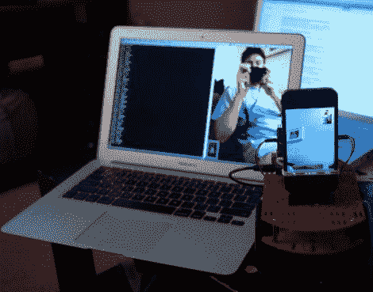

# 小型桌面临场感机器人

> 原文：<https://hackaday.com/2011/10/16/small-tabletop-telepresence-robot/>

当[Peter]在最近的新产品帖子中看到 Sparkfun Magician 机器人底盘时，他立即意识到他必须为一个已经在他脑海中徘徊了一段时间的远程呈现项目拥有一个底盘。

在机器人底盘上，他添加了一个 Arduino 来提供机器人的大脑，一个 Adafruit 电机护罩来控制车轮，一个 Pololu Wixel 用于无线通信。一部 iPhone 安装在机器人的顶部，机器人使用苹果的 Facetime 应用程序与他的笔记本电脑进行通信。这个机器人也可以从他的笔记本电脑上使用 Wixel 进行控制，这使他能够指挥魔术师底盘，就好像它是通过 USB 连接的一样。

虽然他认为这个机器人非常整洁，工作也很好，但[彼得]已经有了改进的想法。除了光滑的表面，机器人底盘在任何地方都有点弱，所以一套新的马达和轮子很可能是他要做的第一个改变。他想为手机的摄像头添加一个基于伺服的瞄准机制，以及一些传感器，以防止机器人从他的桌子上俯冲下来。

除了 iPhone，这可能是我们见过的最便宜的移动远程呈现系统之一，所以我们迫不及待地想知道改进效果如何，以及它们给机器人的成本增加了多少。